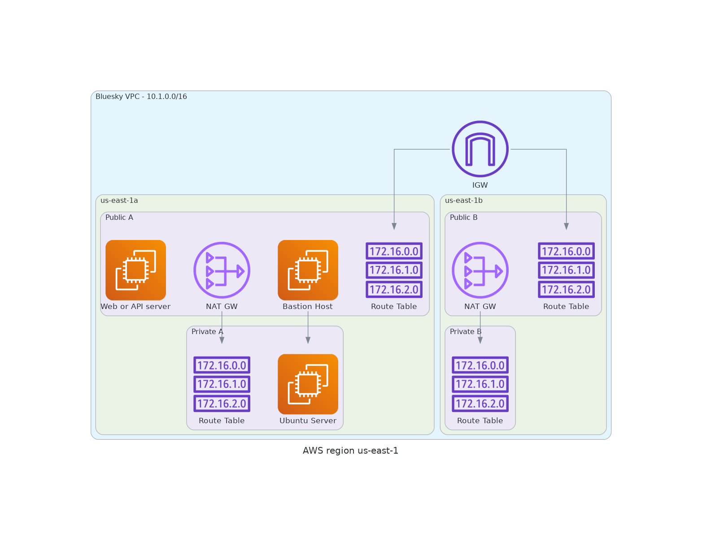

# :cloud: Blue Sky VPC

This repo is an exampple infra deployment which provisions:

- an S3+Dynamodb Backend for terraform state management
- a VPC with 2 public and 2 private subnets (just as an example) with standard CIDRs, basic resource tagging and naming baked in for simplicity
- launches a containerized service on the `web_server` instance's public ip: all you need to do is plug in your aws account and an ECR docker image name for rapid prototyping.

It is meant as a quick starting point - fork the repo and make it your own by modifying the configuration!

**Requirements:**

- an AWS account (a terraform user) that has the necessary permissions to build infra
- You have created an EC2 Key Pair for logging into your servers (you can do this in the AWS console)

## Setup & Deploy

  
Expand for <b>LOCAL DEV SETUP</b> instructions 

:warning: All commands are run from the project root directory.
:warning: Infra is split into layers as follows:

- **Layer 0** - S3+DynamoDB Backend Provisioning for Terraform State Management
- **Layer 1** - VPC Network
- **Layer 2** - EC2 Instances (the ubuntu server, web server and bastion host) <== These are mainly examples; feel free to fork the repo and rip out servers / replace servers.

Therefore, if you want to use the provided `Makefile` to issue your terraform commands, suffix every command shown below with `layer=n`, where n is the nth layer. Eg `make tf:validate layer=2`. The alternative is to move into each layer folder and issue your terraform commands there and remember to cd back out when finished.

### After cloning this repo:

- use `.env.example` template to create `.env` file
- modify `.env` file with terraform user's credentials and other variables as needed
- Deploy **Layer 0** - e.g.:
  - `make tf:init layer=0`
    :point_up: if having trouble with creds, try clearing everything with `unset AWS_ACCESS_KEY_ID AWS_SECRET_ACCESS_KEY AWS_SESSION_TOKEN AWS_SECURITY_TOKEN` and re-check you have right key names and values before continuing with debugging the issue.
  - `make tf.format layer=0`
  - `make tf.validate layer=0`
  - `make tf.plan layer=0`
  - `make tf.apply layer=0`
- Deploy **Layer 1** - i.e. same sequence of commands as above, but replace suffix with `layer=1`
- Deploy **Layer 2** - i.e. same sequence of commands as above, but replace suffix with `layer=2`

### Tear Down

Reverse the sequence of deployments:

- `make tf.destroy layer=2`
- `make tf.destroy layer=1`
- `make tf.destroy layer=0` <== only if you want to destroy the state backend as well.

  
Expand for <b>HOW TO CONNECT TO YOUR SERVERS</b> instructions 

1. For greatest ease of use:

   - make sure your keypair file is locked down (`chmod 400`)
   - make sure your keypair is available in the folder that you will be in when you attempt ssh.

1. **You need to copy across your key file to your bastion host BEFORE you get into the machine.**
   If you look at the format of the command, it has the same form as the ssh command, in that it requests access into the machine. Requesting access into the machine _when you've already ssh'ed into it_ doesn't make sense, so do this before ssh'ing in:

   - `scp -i <keypair.pem> <keypair.pem> ec2-user@ec2-x-x-x.compute-1.amazonaws.com:~/`

   (:point_up: This deposits your key file into your root directory, for example. You can get the exact hostname for your ec2 instance from your aws mgt console > **EC2 > Instances > (select instance) > Connect** and then go the **ssh tab** in that UX).

1. **Now** you can ssh in to your bastion host, eg:

   - `ssh -i <keypair.pem> ec2-user@ec2-x-x-x.compute-1.amazonaws.com`

1. You can ssh into your private server from your bastion host now, following a similar process, since your keyfile is now on your bastion host: `ssh -i <keypair.pem> ubuntu@x.x.x.x` (again: get your exact hostname from the mgt console).

Once you're sure everything works, you should add your key to your keyring and place it somewhere intelligent so that you can just ssh without specifying it each time or having to make sure you're in a specific directory.

